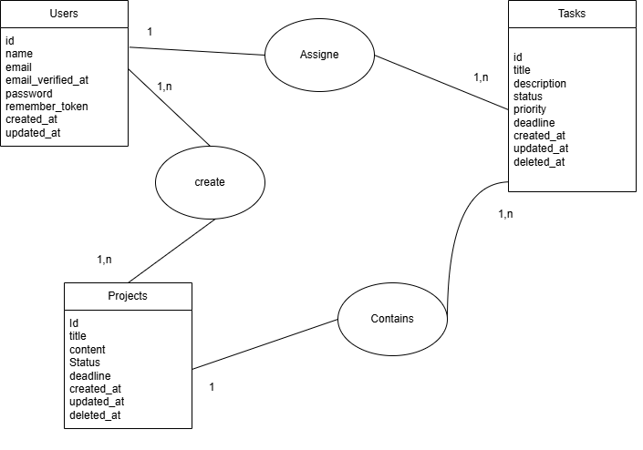
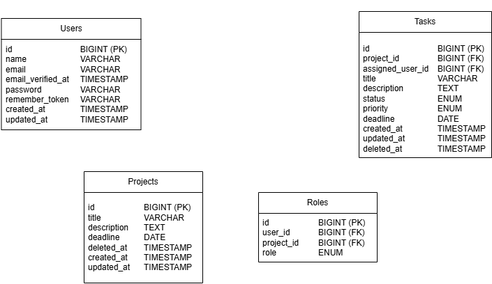
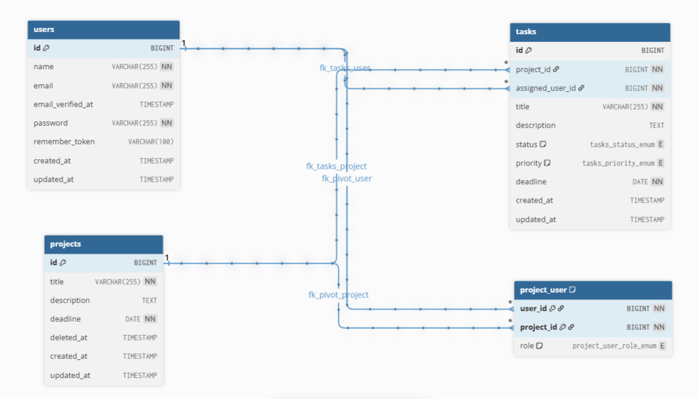
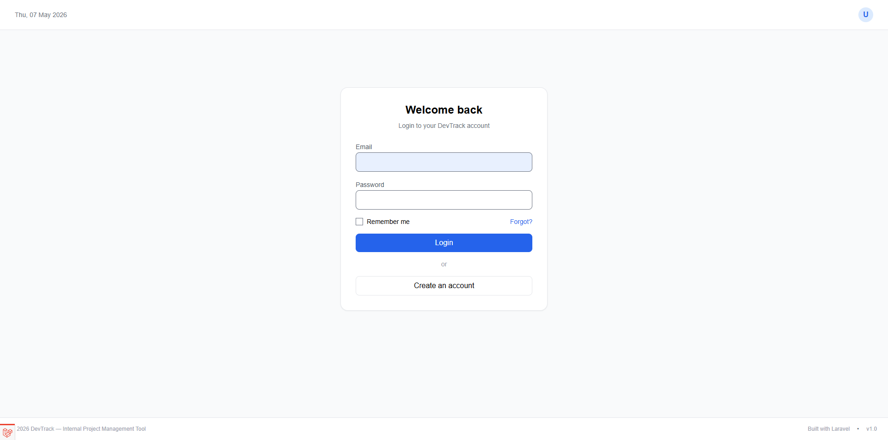
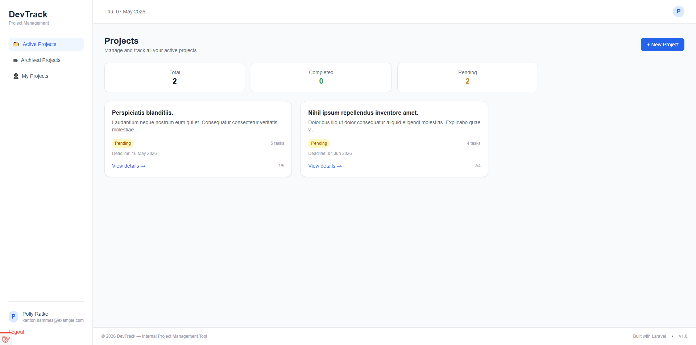
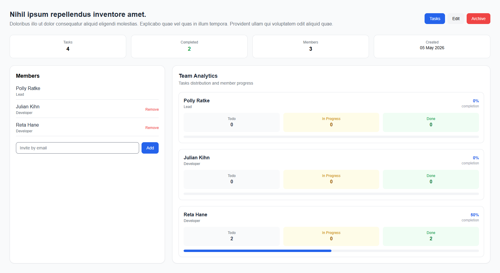
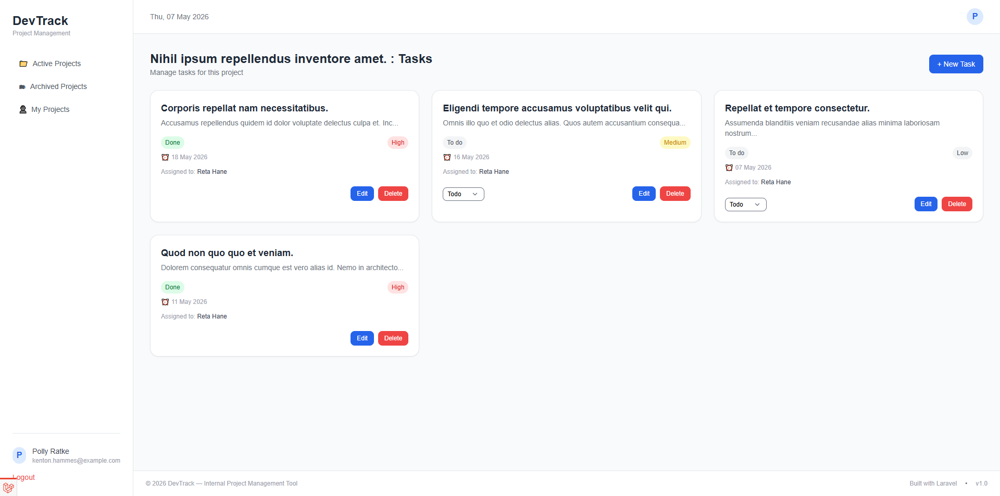
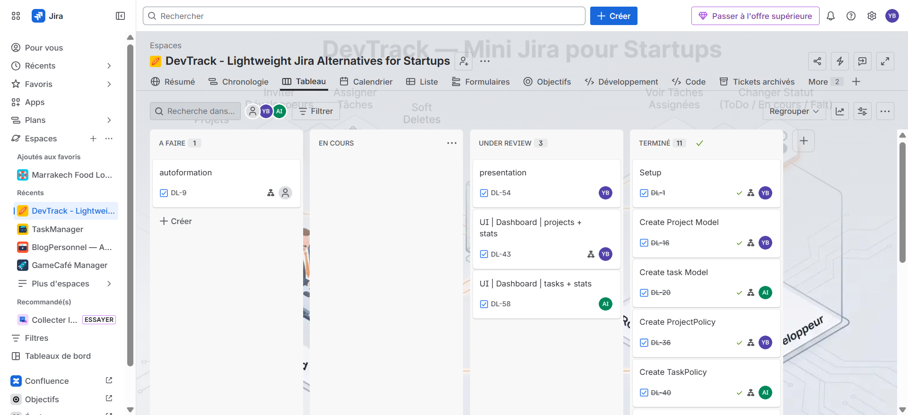

# DevTrack — Team Project Management Platform

## Overview

DevTrack is a collaborative internal project management platform built with **Laravel**.

It helps startup teams organize projects, assign tasks, manage developers, and track project progress in real time.

The application was designed for a startup environment where Team Leads need a simple solution to manage developers without relying on scattered tools like WhatsApp, Excel, or handwritten notes.

The platform follows Laravel best practices using:

- MVC Architecture
- Eloquent ORM
- Blade templating
- Named routes
- Middleware authentication
- Policy-based authorization
- Form Requests validation
- API Resources
- Soft Deletes

---

# 🚀 Features

# 🔐 Authentication

Users can:

- Register securely
- Login securely
- Logout securely

Authentication is powered by Laravel Breeze.

---

# 📁 Project Management

Team Leads can:

- Create projects
- Edit projects
- Archive projects
- Restore archived projects
- Permanently delete archived projects
- Add members to projects
- Remove members from projects

Each project includes:

- Title
- Description
- Deadline
- Members
- Tasks
- Progress tracking

---

# 👥 Roles System

The application uses a many-to-many relationship between users and projects with a pivot role:

- Lead
- Developer

## Permissions

### Lead

Can:

- Manage projects
- Manage members
- Create tasks
- Edit tasks
- Delete tasks
- Change all task statuses

### Developer

Can:

- View project tasks
- Update only assigned task status

Authorization is handled using:

- ProjectPolicy
- TaskPolicy

---

# 📋 Task Management

Project members can:

- View all project tasks
- Track project progress
- See assigned developers
- Monitor task urgency

Leads can additionally:

- Create tasks
- Edit tasks
- Delete tasks
- Assign developers

Developers can:

- Change status of their assigned tasks

---

## Task Fields

- Title
- Description
- Status
    - Todo
    - In Progress
    - Done
- Priority
    - Low
    - Medium
    - High
- Deadline
- Assigned developer

---

# 📊 Analytics Dashboard

Each project contains analytics such as:

- Total tasks
- Completed tasks
- Tasks per member
- Task status distribution
- Completion percentage
- Urgent tasks indicator

---

# 🔌 API

The application exposes an API endpoint:

```text
GET /api/projects/{project}/tasks
```

The endpoint returns:

- Project tasks
- JSON formatted response
- TaskResource formatting
- Accessor-transformed status labels

# 🎁 Bonus Features

- Soft Deletes for archived projects
- Project restoration
- Permanent deletion with forceDelete()
- Accessors:
    - status_label
    - deadline_status
- Local Scope:
    - urgent()
- Analytics dashboard
- Role-based UI rendering using @can
- Scoped route bindings
- N+1 optimization using with()

# 🛠 Installation

## Prerequisites

- PHP 8.2+
- Composer
- Node.js + NPM
- MySQL
- Laravel CLI (optional)
- XAMPP / Laragon / WAMP

## Installation Steps

1. Clone repository

```bash
git clone https://github.com/BEN-ESSAHRAOUI-Yassine/DevTrack.git
cd DevTrack
```

2. Install dependencies

```bash
composer install
npm install
```

3. Environment configuration

```bash
cp .env.example .env
php artisan key:generate
```

4. Configure database

Edit .env

```bash
DB_CONNECTION=mysql
DB_HOST=127.0.0.1
DB_PORT=3306
DB_DATABASE=devtrack
DB_USERNAME=root
DB_PASSWORD=
```

5. Run migrations and seeders

```bash
php artisan migrate:fresh --seed
```

6. Compile frontend assets

```bash
npm run build
```

7. Start server

```bash
php artisan serve
```

Visit:

```bash
http://127.0.0.1:8000
```

# 🛠 Technologies Used

- Laravel 13
- PHP 8+
- MySQL
- Blade
- Eloquent ORM
- Laravel Breeze
- Tailwind CSS
- Vite
- Laravel Policies
- Laravel Form Requests
- Laravel API Resources

---

# 📁 Directory Structure
```text
app/
├── Http/
│ ├── Controllers/
│ │ ├── ProjectController.php
│ │ ├── TaskController.php
│ │ └── ProfileController.php
│ │
│ ├── Requests/
│ │ ├── StoreProjectRequest.php
│ │ ├── UpdateProjectRequest.php
│ │ ├── StoreTaskRequest.php
│ │ ├── UpdateTaskRequest.php
│ │ └── UpdateTaskStatusRequest.php
│ │
│ └── Resources/
│ └── TaskResource.php
│
├── Models/
│ ├── User.php
│ ├── Project.php
│ └── Task.php
│
├── Policies/
│ ├── ProjectPolicy.php
│ └── TaskPolicy.php

database/
├── migrations/
├── factories/
└── seeders/

resources/views/
├── layouts/
├── auth/
├── projects/
├── tasks/
└── components/

routes/
├── web.php
└── api.php
```
# 🔒 Security Measures

The application implements several Laravel security best practices:

- Authentication middleware
- Password hashing
- CSRF protection
- Form Request validation
- Policy-based authorization
- Route model binding
- Scoped bindings
- Protected routes
- Authorization checks using @can

# 🛣 Routing System

| Method | Route                                   | Controller                     |
| ------ | --------------------------------------- | ------------------------------ |
| GET    | /projects                               | ProjectController@index        |
| GET    | /projects/create                        | ProjectController@create       |
| POST   | /projects                               | ProjectController@store        |
| GET    | /projects/{project}                     | ProjectController@show         |
| GET    | /projects/{project}/edit                | ProjectController@edit         |
| PUT    | /projects/{project}                     | ProjectController@update       |
| DELETE | /projects/{project}                     | ProjectController@destroy      |
| POST   | /projects/{project}/restore             | ProjectController@restore      |
| DELETE | /projects/{project}/force-delete        | ProjectController@forceDelete  |
| GET    | /projects/{project}/dashboard           | TaskController@index           |
| POST   | /projects/{project}/members             | ProjectController@addMember    |
| DELETE | /projects/{project}/members/{user}      | ProjectController@removeMember |
| POST   | /projects/{project}/tasks               | TaskController@store           |
| PUT    | /projects/{project}/tasks/{task}        | TaskController@update          |
| PATCH  | /projects/{project}/tasks/{task}/status | TaskController@updateStatus    |
| DELETE | /projects/{project}/tasks/{task}        | TaskController@destroy         |

---

# 🗄 Database Design

## Tables

- users
- projects
- project_user
- tasks

## Relationships

User ↔ Projects : Many-to-many relationship using: project_user With pivot column: role
Project → Tasks : One project has many tasks.
Task → User : One task belongs to one assigned developer.

## MCD



## MLD



## DB Diagram



# 📌 Laravel Concepts Used

- [ ] **Policies**

Used for:

- Project ownership authorization
- Role-based permissions
- Task access protection

- [ ] **Form Requests**

Used for:

- Project validation
- Task validation
- Status update validation

- [ ] **Soft Deletes**

Projects are archived instead of permanently deleted.

- [ ] **Accessors**

- status_label

Transforms:

```text
in_progress
```

Into:

```text
In Progress
```

- deadline_status

Determines if task is:

- Normal
- Urgent

* [ ] **Local Scope**

```text
urgent()
```

Filters tasks with:

- Deadline within 48 hours
- Status not done

# 🐞 Debugging Tools

- [ ] **Laravel Debugbar**

Used to:

- Detect N+1 queries
- Monitor SQL queries
- Analyze performance

- [ ] **Laravel Telescope**

Access:

```text
/telescope
```

Used to:

- Inspect requests
- View exceptions
- Monitor queries
- Debug authorization
- Analyze payloads

# 📸 Screenshots

## Login Page



## Dashboard



## Project Details



## Tasks Dashboard



## Jira board



# 📋 [Jira Board](https://ybenessahraoui.atlassian.net/jira/software/projects/DL/boards/134?atlOrigin=eyJpIjoiNTg1YzhhZDZlZDA3NDdhOWJkMDllMDAxNzYyOGE5MmUiLCJwIjoiaiJ9)

# 📋 [Presentation Link](https://docs.google.com/presentation/d/1Uf9lj9LeJ4yYyABP1gjNnt4vbx7z-2XxtvhyY9NFSxo/edit?usp=sharing)
